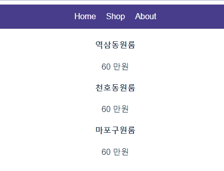

# 🕵♀ Vue 반복문 v-for

상단의 메뉴를 만든다고 가정하고 아래와 같은 코드를 작성하면 a 태그가 반복되고 있다.

이렇게 **반복되는 부분을 축약하고 싶을때** <mark style="background-color:orange;">**v-for**</mark>을 사용하면 된다.

```markup
<div class="menu">
  <a>Home</a>
  <a>Products</a>
  <a>About</a>
</div>
```


### 🙂v-for HTML 반복문


1. 반복할 태그에 <mark style="background-color:orange;">**v-for = "작명 in 반복할횟수"**</mark> 를 적는다.
2. <mark style="background-color:orange;">**:key = "작명"**</mark> 도 추가한다 (이거 없으면 에러남)

```markup
<div class="menu">
    <a v-for="작명 in 3" :key="작명">Home</a>
</div>
```

<div align="left">

<figure><figcaption><p>Home이 3번 반복되는 모습</p></figcaption></figure>

</div>


### 🙂 v-for 반복문 2

**v-for 반복문에서 array나 object도 data로 저장되어있으면 사용할 수 있다.**

```markup
<div class="menu">
  <a v-for="작명 in 메뉴들" :key="작명"> {{작명}} </a>
</div>
```

```javascript
 data(){
    return{
      메뉴들 : ['Home', 'Shop', 'About'],
    }
  }
```

<div align="left">

<figure><figcaption><p>배열 안에 텍스트가 차례로 나온 화면</p></figcaption></figure>

</div>


### 🙂v-for 변수는 두개까지 가능

```markup
<div class="menu">
  <a v-for="(작명,i) in 메뉴들" :key="i"> {{ 작명 }}</a>
</div>
```

첫째 작명한건 아까 설명했던 array안의 데이터가 되는 것이고

둘째 작명한건 0, 1, 2 .. 이런 식으로 1씩 증가하는 정수가 됩니다.

반복 횟수를 알려주는 숫자라고  생각하면 된다.
